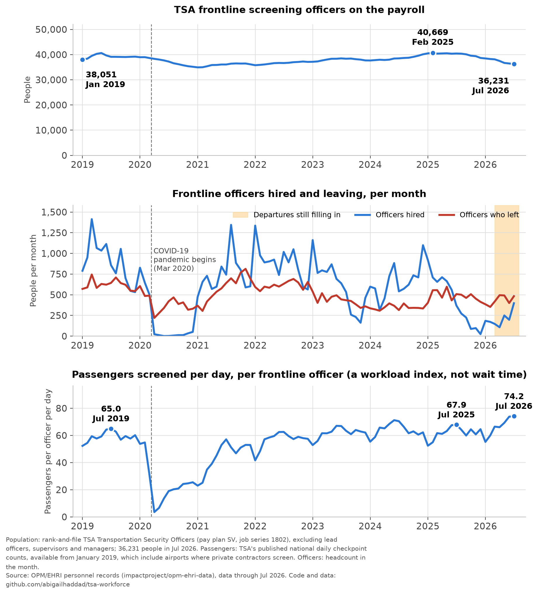

# TSA frontline officers: is the agency finding it easy or hard to recruit and keep people?

Built from OPM/EHRI personnel records of hires, departures and monthly headcount
([`impactproject/opm-ehri-data`](https://huggingface.co/datasets/impactproject/opm-ehri-data)), read directly with DuckDB. It was prompted by a late-September
report that TSA is removing the chairs from travel-document-checker podiums.

**Who it covers.** Rank-and-file Transportation Security Officers: pay plan `SV`, job series `1802`, supervisory status "all other positions". Lead officers,
supervisors and managers are excluded: leads lead other officers, and no source says whether the standing rule covers them. The records have no job title,
airport or checkpoint position, so travel document checkers cannot be picked out of this group; officers also rotate between positions.



The notebook, [`tsa_workforce.ipynb`](tsa_workforce.ipynb), has the analysis, with every figure computed from the data. This README has no statistics on purpose;
the chart above and the notebook carry them. The notebook asks:

1. Is TSA hiring frontline officers at a normal pace, compared with its own history?
2. Is that workforce shrinking?
3. How much passenger volume is there per officer? (TSA publishes passenger counts but not wait times, so this is a rough workload index, not a measure of how long lines are.)
4. Who is leaving: new hires, or officers who have been there for years?

All three panels start in the same month: when TSA's published passenger counts begin, which is later than when the personnel data allow. The personnel data go back further (to the point where OPM begins coding lead officers separately, so this group can be isolated) and are used in the notebook's tables.

## What it can't answer
- **How long the lines are.** TSA records wait times hourly at every checkpoint but publishes only a summary measure, not the underlying data. Passengers per officer is a stand-in for workload, not for waiting time.
- **Whether recruiting is hard.** There are no applicant, offer or time-to-fill data, and a hiring drop could be TSA's own choice (a freeze, a budget limit, a pause).
- **Any effect of the chair policy.** It post-dates the data.
- **Individual trajectories.** There are no person IDs; every rate is a flow divided by an average headcount.

## Method checks
Run live in the notebook's section 0: TSA's agency code is the only one and is stable; monthly files add new actions rather than restating old ones; recent months are
incomplete and the notebook measures by how much; headcount has no gaps; the national passenger counts have no missing days and are compared with TSA's weekly hourly files (the notebook reports the gap); TSA's accessions are new hires only; headcount and flows reconcile only roughly (headcount is used for levels,
flows for rates, never chained); buyout-program exits are separable; OPM's release notes are searched for anything about TSA; and `src/verify.py` compares a sample of OPM's original
files with the HuggingFace mirror and with our extract.

## Reproduce
```bash
pip install -r requirements.txt
python src/build_file_map.py   # OPM API -> file list, as-of date, newest month, release notes (data/)
python src/extract.py          # TSA slice -> data/*.parquet   (HuggingFace rate-limits, so this takes a while)
python src/history.py          # earlier years' hires/separations + agency-code audit -> data/*.csv
python src/verify.py           # OPM API vs HF mirror vs our extract -> data/proof_sample.csv
python src/fetch_throughput.py # TSA's published national daily passenger counts -> data/tsa_daily_passengers.csv
python src/check_throughput.py # cross-check those counts against TSA's weekly hourly files (needs `pdftotext` from poppler)
jupyter nbconvert --to notebook --execute --inplace tsa_workforce.ipynb   # analysis; saves figures/central.png and figures/linkedin.png
```

## Layout
- `tsa_workforce.ipynb` — the analysis, start to finish; saves the charts to `figures/`: `central.png` (the three panels above) and `linkedin.png` (a portrait version of the headcount chart under the headline, sized for LinkedIn).
- `assets/headline.png` — the news-headline screenshot used in the LinkedIn graphic (credit the publication when posting).
- `src/tsa.py` — shared definitions: TSA = `HSBC`, frontline officers = pay plan `SV` + series `1802` + supervisory status "all other positions".
- `src/build_file_map.py`, `src/extract.py`, `src/history.py`, `src/verify.py` — the personnel-data pipeline and the check against OPM's original files.
- `src/fetch_throughput.py`, `src/check_throughput.py` — the passenger counts and their cross-check against TSA's other publication of the same data.
- `data/*.parquet` are git-ignored extracts (rebuild with `extract.py`); the CSV/JSON audit files are committed.

The repo will live at https://github.com/abigailhaddad/tsa-workforce.
